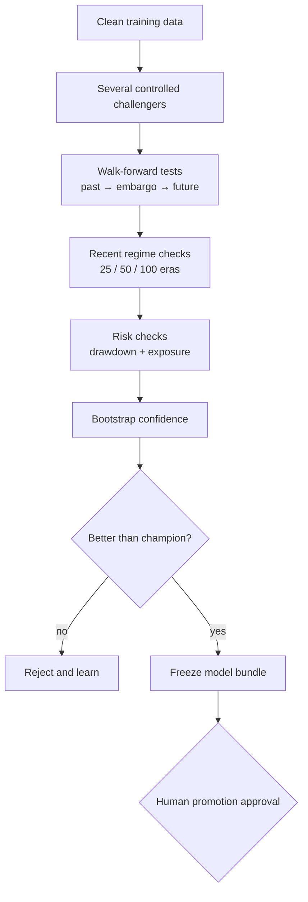

# Modeling and Optimization — Plain-Language Guide

The goal is not one lucky score. The goal is a model that remains useful across
different market regimes.

## What each metric means

| Metric | Question it answers |
|---|---|
| Correlation | Are predictions directionally useful? |
| Sharpe | Is performance steady rather than spiky? |
| Drawdown | How painful was the worst losing stretch? |
| Hit rate | How often was an era positive? |
| Feature exposure | Is the model overly dependent on obvious features? |
| Recent 25/50/100 | Does it still work in the current regime? |
| Bootstrap interval | Could the apparent gain be ordinary noise? |
| MMC | Does it add something different from Numerai's meta model? |

## How optimization is controlled

1. Change one declared idea: seed, feature family, model recipe, or
   neutralization amount.
2. Train reproducibly and record data, configuration, and checksum.
3. Use ordered walk-forward folds with an embargo.
4. Choose settings on development folds only.
5. Use the untouched lockbox once for the final comparison.
6. Reject duplicate or highly correlated ensemble members.
7. Promote only a frozen bundle whose files and weights match its evaluation.

This avoids “optimizing” by repeatedly looking at the same answers.

At prediction time, the loader reads the exact feature union declared inside
the frozen model. It does not assume one global feature set, so a specialized
ensemble cannot silently receive the wrong live columns.

## Production versus shadow models

| Tier | Purpose | Historical gate | Stake eligible? |
|---|---|---|---|
| Production | Competition contender | Full strict policy and positive recent-50 | Only after live evidence |
| Shadow | Collect forward evidence for a distinct idea | Positive broad/recent-25/100, bounded recent-50 weakness, low exposure, correlation ≤ 0.85 to portfolio | Never |

Shadow slots are experiments, not weakened champions. They require frozen
evidence, unique artifact checksums, portfolio approval, and a separate
round-specific submission approval.

## Experiment evidence

The neutralized baseline produced:

| Window | Mean correlation |
|---|---:|
| All 646 resolved eras | 0.01000 |
| Recent 100 | 0.00191 |
| Recent 50 | **-0.00152** |
| Recent 25 | 0.00300 |

Feature exposure was 0.0977 and the bootstrap mean interval was approximately
0.0090–0.0111. Broad history was positive, but recent-50 performance was
negative, so the model was rejected.

Three bounded routes were then tested:

| Route | Development recent-50 | Lockbox | Decision |
|---|---:|---:|---|
| Three-seed baseline | +0.00715 | -0.00048 | Reject |
| Diversified targets | +0.00885 | -0.00097 | Reject |
| Feature families (`small + serenity`) | +0.01092 | **+0.00037** | Promotion candidate |

The feature-family candidate's full mean correlation is 0.01014 with Sharpe
0.699 and maximum drawdown 0.144. Its positive lockbox is small, so live results
must still be collected before staking.

## What “winning” means here

No system can guarantee first place. This OS improves the controllable parts:
zero silent failures, disciplined experiments, correct submissions, robust
promotion, and conservative capital allocation.
