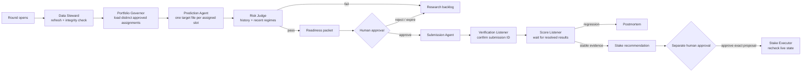

# Numerai Winning OS — Operating Map

This system separates **thinking**, **approval**, and **execution**. Agents do
the repeatable work. A person approves submissions, model promotions, and stake
changes.

## The agents

| Agent | Simple job | Can change money/platform state? |
|---|---|---|
| Platform Scout | Verifies API/data contracts, round, deadline, and model slots | No |
| Data Steward | Refreshes data and detects damaged files | No |
| Portfolio Governor | Maps each slot to one distinct approved artifact | No |
| Prediction Agent | Produces predictions from one frozen model | No |
| Risk Judge | Tests long-term and recent performance | No |
| Governance Guard | Creates a time-limited approval challenge | No |
| Submission Agent | Uploads only the approved file | Yes, submission only |
| Verification Listener | Confirms Numerai returned the submission ID | No |
| Score Listener | Reads resolved results and triggers postmortems | No |
| Research Agent | Compares challengers and prepares promotion proposals | No |
| Stake Governor | Reconciles live stake and recommends a capped amount | Proposal only |
| Stake Executor | Rechecks and requests one approved stake change | Yes, stake only |

## Events and triggers

| Trigger | What runs | Expected result |
|---|---|---|
| Every day, 10:45 / 11:05 | Native Platform Monitor / native alert | API, data-version, round, mapping, and stake-read compatibility |
| Every day, 11:00 / 11:15 | Native Deadline Guard / Codex watchdog | Missing/ready/submitted warning before close |
| Every day, 15:00 / 15:30 | Native Portfolio Readiness / Codex watchdog | Per-slot packet, submitted skip, or rejection |
| Every day, 15:20 / 15:30 | Native Competition Status / shared Codex watchdog | Coverage, streak, rank, and season progress |
| Every day, 18:00 / 18:15 | Native Score Listener / Codex watchdog | New outcomes or “nothing new” |
| Every day, 18:05 / 18:15 | Native Stake Audit / shared Codex watchdog | Stake-policy reconciliation |
| Every day, 19:00 / 19:15 | Native State Backup / Codex watchdog | Verified credential-free recovery archive |
| Every day, 19:10 / 19:15 | Native System Health / native alert | Loaded jobs plus fresh successful evidence |
| Sunday, 16:00 / 16:15 | Native Research Review / Codex watchdog | Robustness and promotion report |
| Human approves packet | Submission Agent | One upload to one model |
| New resolved score is poor | Postmortem trigger | Research task, no auto-retry |
| 20+ post-deployment resolved rounds | Stake review becomes eligible | Still requires caps and approval |

Times are local to the automation host. All execution uses macOS `launchd`, so
it does not depend on Codex being open; Codex jobs only inspect the results.
The native jobs execute from `~/Library/Application Support/Numerai` because
macOS can deny unattended access to `Desktop` and `Documents`.
Native notifications run at 11:05, 15:25, 18:12, and 19:15 and deduplicate against
durable report identity.

## Fail-closed rules

- A damaged dataset is replaced atomically before use.
- A broken platform contract fails before the daily workflow; a newer data
  version opens a migration review rather than switching production.
- Constant raw predictions are rejected before ranking.
- One readiness packet targets one Numerai model.
- One active portfolio assignment targets one slot, and duplicate artifact
  checksums across slots are rejected.
- Approval is tied to the round, model UUID, prediction file, evaluation, actor,
  and expiry.
- A revoked or changed packet cannot be submitted.
- A round/model pair cannot be submitted twice by this control plane.
- Direct legacy submit routes and file-flag approval are disabled.
- Staking defaults to zero and cannot reuse a previous model's score history.
- Shadow assignments are permanently stake-ineligible and cannot be activated
  without frozen evidence plus a portfolio approval challenge.
- Stake approval binds the complete proposal, and execution rechecks live
  balances, model mapping, current caps, and active portfolio eligibility.
- A stake execution intent blocks automatic retry after an uncertain API call.
- A loaded service without fresh successful evidence is unhealthy; the
  supervisor reports it but does not blindly retry mutations.

## Current state

The `small + serenity` feature-family champion is assigned to `kvmmn_te` and
has a verified round-1302 submission. Distinct shadow artifacts are active on
`kvmmn` and `kvmmn_fn`; both received separate human approval and now have
verified zero-stake round-1302 submissions. Current coverage is `3 / 3`.

The live stake audit found `0.136245 NMR` on `kvmmn`, which is now a
stake-ineligible shadow slot. This is reported as a policy violation. No
automatic change was made, increase caps remain zero, and a decrease would
still require a configured per-change cap plus a separate proposal, challenge,
and exact confirmation.
