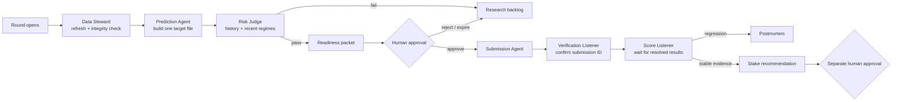

# Numerai Winning OS — Operating Map

This system separates **thinking**, **approval**, and **execution**. Agents do
the repeatable work. A person approves submissions, model promotions, and stake
changes.

## The agents

| Agent | Simple job | Can change money/platform state? |
|---|---|---|
| Platform Scout | Finds the round, deadline, and model slot | No |
| Data Steward | Refreshes data and detects damaged files | No |
| Prediction Agent | Produces predictions from one frozen model | No |
| Risk Judge | Tests long-term and recent performance | No |
| Governance Guard | Creates a time-limited approval challenge | No |
| Submission Agent | Uploads only the approved file | Yes, submission only |
| Verification Listener | Confirms Numerai returned the submission ID | No |
| Score Listener | Reads resolved results and triggers postmortems | No |
| Research Agent | Compares challengers and prepares promotion proposals | No |
| Stake Governor | Recommends a capped amount after live evidence | Proposal only |

## Events and triggers

| Trigger | What runs | Expected result |
|---|---|---|
| Every day, 15:00 | Native Daily Readiness | Packet or a clear rejection reason |
| Every day, 15:30 | Readiness Watchdog | Confirms the native run completed |
| Every day, 11:00 | Deadline Guard | Missing/ready/submitted warning before close |
| Every day, 18:00 | Score Listener | New outcomes or “nothing new” |
| Sunday, 16:00 | Weekly Research Review | Robustness and promotion report |
| Human approves packet | Submission Agent | One upload to one model |
| New resolved score is poor | Postmortem trigger | Research task, no auto-retry |
| 20+ post-deployment resolved rounds | Stake review becomes eligible | Still requires caps and approval |

Times are local to the automation host. Native readiness uses macOS `launchd`,
so it does not depend on Codex being open.

## Fail-closed rules

- A damaged dataset is replaced atomically before use.
- Constant raw predictions are rejected before ranking.
- One readiness packet targets one Numerai model.
- Approval is tied to the round, model UUID, prediction file, evaluation, actor,
  and expiry.
- A revoked or changed packet cannot be submitted.
- A round/model pair cannot be submitted twice by this control plane.
- Direct legacy submit routes and file-flag approval are disabled.
- Staking defaults to zero and cannot reuse a previous model's score history.

## Current state

The first repaired model passed broad history but failed the newest 50-era
regime, so its readiness packet was revoked. Seed and target ensembles also
failed the lockbox. A later `small + serenity` feature-family challenger passed
both development and lockbox checks and is frozen for human promotion review.
It remains unsubmitted.
