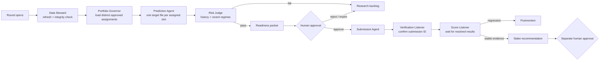

# Numerai Winning OS — Operating Map

This system separates **thinking**, **approval**, and **execution**. Agents do
the repeatable work. A person approves submissions, model promotions, and stake
changes.

## The agents

| Agent | Simple job | Can change money/platform state? |
|---|---|---|
| Platform Scout | Finds the round, deadline, and model slot | No |
| Data Steward | Refreshes data and detects damaged files | No |
| Portfolio Governor | Maps each slot to one distinct approved artifact | No |
| Prediction Agent | Produces predictions from one frozen model | No |
| Risk Judge | Tests long-term and recent performance | No |
| Governance Guard | Creates a time-limited approval challenge | No |
| Submission Agent | Uploads only the approved file | Yes, submission only |
| Verification Listener | Confirms Numerai returned the submission ID | No |
| Score Listener | Reads resolved results and triggers postmortems | No |
| Research Agent | Compares challengers and prepares promotion proposals | No |
| Stake Governor | Recommends a capped amount after live evidence | Proposal only |

## Events and triggers

| Trigger | What runs | Expected result |
|---|---|---|
| Every day, 11:00 / 11:15 | Native Deadline Guard / Codex watchdog | Missing/ready/submitted warning before close |
| Every day, 15:00 / 15:30 | Native Portfolio Readiness / Codex watchdog | Per-slot packet, submitted skip, or rejection |
| Every day, 18:00 / 18:15 | Native Score Listener / Codex watchdog | New outcomes or “nothing new” |
| Sunday, 16:00 / 16:15 | Native Research Review / Codex watchdog | Robustness and promotion report |
| Human approves packet | Submission Agent | One upload to one model |
| New resolved score is poor | Postmortem trigger | Research task, no auto-retry |
| 20+ post-deployment resolved rounds | Stake review becomes eligible | Still requires caps and approval |

Times are local to the automation host. All execution uses macOS `launchd`, so
it does not depend on Codex being open; Codex jobs only inspect the results.
The native jobs execute from `~/Library/Application Support/Numerai` because
macOS can deny unattended access to `Desktop` and `Documents`.

## Fail-closed rules

- A damaged dataset is replaced atomically before use.
- Constant raw predictions are rejected before ranking.
- One readiness packet targets one Numerai model.
- One active portfolio assignment targets one slot, and duplicate artifact
  checksums across slots are rejected.
- Approval is tied to the round, model UUID, prediction file, evaluation, actor,
  and expiry.
- A revoked or changed packet cannot be submitted.
- A round/model pair cannot be submitted twice by this control plane.
- Direct legacy submit routes and file-flag approval are disabled.
- Staking defaults to zero and cannot reuse a previous model's score history.
- Shadow assignments are permanently stake-ineligible and cannot be activated
  without frozen evidence plus a portfolio approval challenge.

## Current state

The `small + serenity` feature-family champion is assigned to `kvmmn_te` and
has a verified round-1302 submission. `kvmmn` and `kvmmn_fn` remain explicitly
unassigned in the active portfolio. Two diverse zero-stake shadow candidates
have passed the separate forward-test policy and are frozen in a new portfolio
proposal. They remain inactive until human approval.
